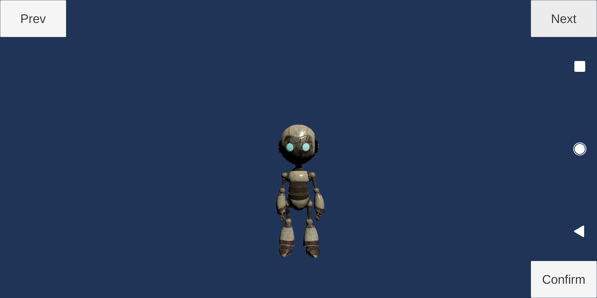
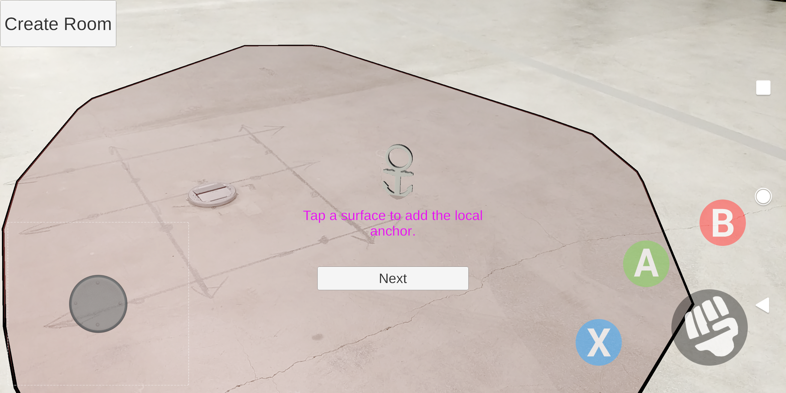
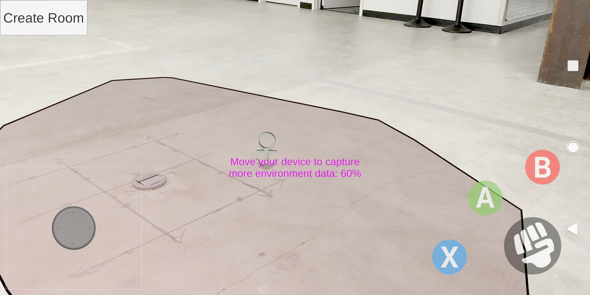
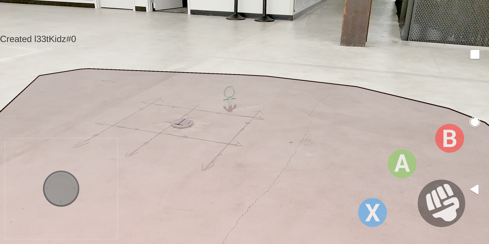
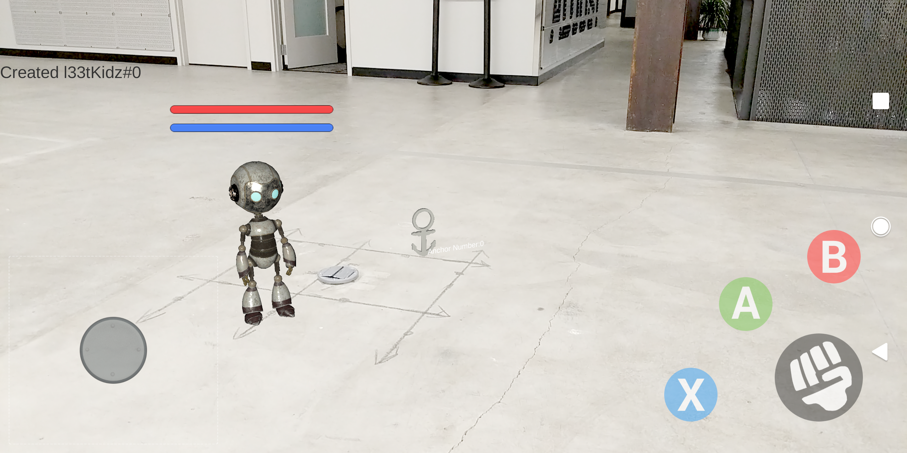
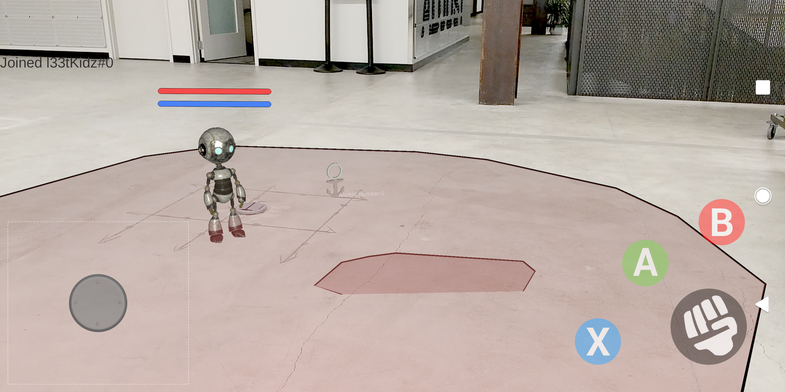
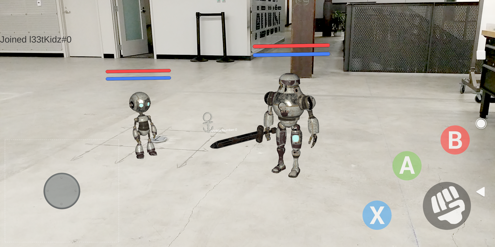

# Social Robot AR

This repo is the AR social functions of L33tKidz's launch product. It is based on AR Foundation and AzureSpatialAnchor. It aims to build a multi-platform AR shared experience including ARCore (Android), ARKit (IOS), and WMR (HoloLens). Currently, it is tested on ARCore platform only.

## Requirements

* Two developer enabled and ARCore capable Android devices
* Unity 2019.1.14f1 including the Android Build Support and Android SDK 9.+(Q) & NDK Tools modules
* Git

## How to Set up this project

~~1. Follow the [AR Core Tutorial](https://developers.google.com/ar/develop/unity/quickstart-android)  
2. There is a problem when you import the ARCore SDK for Unity if you use the Unity 2019. To fix them, import `Multiplayer HLAPI` and `XR Legacy Input Helpers packages` in package manager. [Reference](https://forum.unity.com/threads/arcore-sdk-console-error-spatialtracking-does-not-exist-in-the-namespace-unityengine.531243/)~~

1. Set up your Azure Spatial Anchor Account.  
Follow the [Azure Spatial Anchor Tutorial](https://docs.microsoft.com/en-us/azure/spatial-anchors/quickstarts/get-started-unity-android), do the following 2 steps.  
    1. Create an Azure account.  
    2. Create a `Spatial Anchors` resource.  
    Store the `Account ID` and `Primary Key` into some places. In this project, the  
        * `Account ID` 6616fce2-1b28-4fed-8ba9-c0bfb5acb35b
        * `Primary Key` AWFhKCI/4SBNs+M9ZrHuuD3KT+9bxoLDTJZmokyRxPM=
2. Set up your Sharing Anchors Service and Plan.  
Follow the [Tutorial: Share Azure Spatial Anchors across sessions and devices](https://docs.microsoft.com/en-us/azure/spatial-anchors/tutorials/tutorial-share-anchors-across-devices) to do the following 3 steps.
    1. Download the Unity sample project
    2. Deploy your Sharing Anchors Service
    3. After you publish your ASP.NET web app, copy the the URL of the web page. In this project, it is
        * `https://sharingserviceforsocialar.azurewebsites.net`
3. [Optional] Set up Azure Cosmos DB to store Anchors permanently.  
If you want to store your anchors into CosmosDB other than InMemory, follow the [Tutorial: Share Azure Spatial Anchors across sessions and devices with an Azure Cosmos DB back end] to do the following steps.
    1. Create a database account.
    2. Deploy the sharing anchors service.
    3. After you publish your ASP.NET web app, copy the the URL of the web page.
4. Configure this project.
    1. Download or clone this project, use Unity to open this project, from `Window - Package Manger`, install the following packages if needed
        * `AR Foundation`
        * `AR Core XR Plugin`
        * `AR Kit XR Plugin`
        * `Windows Mixed Reality`
        * `Multiplayer HLAPI`
        * `XR Legacy Input Helpers`
    2. In the project, navigate to `Assets\AzureSpatialAnchors.SDK\Resources\SpatialAnchorConfig`, in the inspector, paste your `Azure Account ID` and `Primary Key` created in step 1 to corresponding positions
    
    3. Open `Assets\Scenes\main`, in the Hierarchy, select `AzureSpatialAnchors`. In the Inspector, paste the URL of the web page got from step 2 or step 3 to the `Base Sharing URL`
    
5. Build and Deploy.
    1. Open `File - Build Settings`
    2. Under Scenes in build, make sure the first one is `Scenes/RobotSelection` and the second one is `Scenes/main`
    3. In the platform, click `Android`, then click `Switch Platform`
    4. Connect your phone to PC via USB. Make sure you open the `Developer Mode` in your phone and allowing `USB Debugging`
    5. Click `Build And Run` in Unity, the project will be built and deployed automatically to your phone. The total build settings should be as follows.
    

## How to Play

1. Make sure your two phones connected the same WiFi
2. Finish the set up pipeline, you will see the an App called `SocialRobot` on your phone. It looks like as follows

3. Open the App, select your favorite robot in the page, and then click `Confirm`

4. In the **first phone**, click `Create Room`, then you tap the detected ground (red surface) to place an `anchor`

5. Click `Next` button, then scan the environment until it arrives 100%

6. After you finish your scanning, a text `Created l33tKidz#X` will appear (X is a digit number)

7. Tap the detected ground (red surface) to place your robot!

8. In the **second phone**, after choosing the robot, tap `Check Room` several time, the name `l33tKidz#X` same with the first phone will appear

9. Tap `Join Room`, and scan your environment until the text `Joined l33tKidz#X` appears. At this time, if the first phone already place a robot, you should see it in the second phone

10. Tap the detected ground (red surface) to place the second robot. And the two robot can be seen by the two phones at the same time

11. Control your robot and battle with your friend!

## Azure Spatial Anchor Unity Project Analysis

* Create
    * Create anchor and share it
    * AzureSpatialAnchorsSharedAnchorDemoScript.cs InitializeCreateFlowDemo()
    * Steps:
        * Change the currentAppState
        * Trigger EnableCorrectUIControls()
        * Trigger AdvanceDemoAsync() ?
        * Trigger AdvanceCreateFlowDemoAsync()
* Load
    * Download and match
    * AzureSpatialAnchorsSharedAnchorDemoScript.cs InitializeLocateFlowDemo()
* Exit
    * Reload the scene
    * DemoScriptBase.cs ReturnToLauncher()
